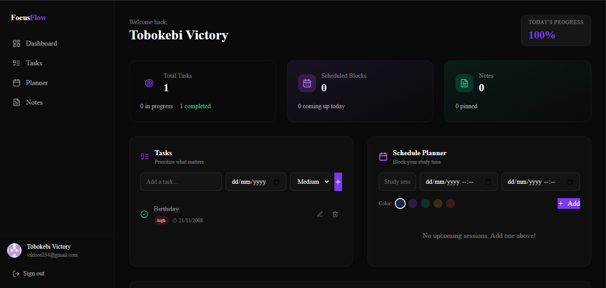

# FocusFlow - Student Productivity Dashboard

A modern productivity dashboard for students to manage tasks, plan study sessions, and capture notes. Built with Next.js 14, NextAuth.js, and Drizzle ORM.

## Features

- **Task Management** - Create, prioritize (low/medium/high), and track tasks from todo to done
- **Schedule Planner** - Weekly calendar view to block study time and appointments
- **Quick Notes** - Capture lecture notes and ideas with pinning support
- **Progress Tracking** - Dashboard with completion stats and visual progress indicators
- **GitHub OAuth** - Secure authentication with your GitHub account
- **Dark Theme** - Beautiful dark UI optimized for focus

## Tech Stack

- **Framework**: Next.js 14 (App Router)
- **Authentication**: NextAuth.js v5 with GitHub OAuth
- **Database**: PostgreSQL (Aiven) with Drizzle ORM
- **Styling**: Tailwind CSS
- **Icons**: Lucide React
- **Fonts**: Inter + JetBrains Mono

## Getting Started

### Prerequisites

- Node.js 18+
- PostgreSQL database (Aiven, Supabase, or local)
- GitHub OAuth app

### Installation

```bash
# Clone the repository
git clone https://github.com/Viktree234/productivity-dashboard.git
cd productivity-dashboard

# Install dependencies
npm install

# Set up environment variables
cp .env.local.example .env.local
# Edit .env.local with your credentials:
# - DATABASE_URL (PostgreSQL connection string)
# - AUTH_SECRET (run: openssl rand -base64 32)
# - GITHUB_ID (from GitHub OAuth app)
# - GITHUB_SECRET (from GitHub OAuth app)

# Push database schema
npm run db:push

# Run development server
npm run dev
```

### GitHub OAuth Setup

1. Go to GitHub Settings → Developer settings → OAuth Apps
2. Create new OAuth App with:
   - **Homepage URL**: `http://localhost:3000`
   - **Authorization callback URL**: `http://localhost:3000/api/auth/callback/github`
3. Add your Client ID and Client Secret to `.env.local`

## Project Structure

```
app/
├── (landing)/           # Marketing landing page
│   └── page.tsx
├── (dashboard)/         # Authenticated dashboard routes
│   ├── layout.tsx      # Sidebar layout
│   ├── dashboard/     # Main dashboard view
│   ├── tasks/         # Task management
│   ├── planner/      # Weekly calendar
│   └── notes/         # Note-taking
├── api/auth/           # NextAuth.js API routes
└── globals.css         # Global styles

lib/db/
├── db.ts              # Database connection
└── schema.ts          # Drizzle schema

auth.ts                # NextAuth.js configuration
drizzle.config.ts      # Drizzle configuration
```

## Deployment

### Vercel (Recommended)

```bash
# Install Vercel CLI
npm i -g vercel

# Deploy
vercel
```

Add your environment variables in the Vercel dashboard:

- `DATABASE_URL`
- `AUTH_SECRET`
- `GITHUB_ID`
- `GITHUB_SECRET`

## Live Demo

[View Demo](https://productivity-dashboard-kappa-opal.vercel.app/)

## Screenshot



## License

MIT
